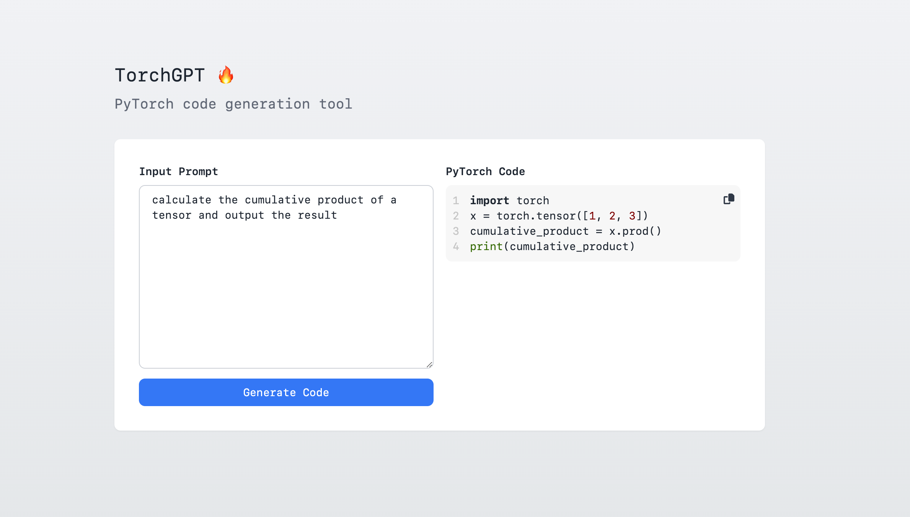

# TorchGPT



TorchGPT provides an intuitive interface for users to generate PyTorch code using natural language. This tool helps developers prototype faster and reduces the barrier to entry for deep learning projects.

## Table of Contents

- [TorchGPT](#torchgpt)
  - [Table of Contents](#table-of-contents)
  - [Features](#features)
  - [Prerequisites](#prerequisites)
  - [Installation](#installation)
  - [Running the Application](#running-the-application)
  - [Usage](#usage)
  - [Contributing](#contributing)
  - [Author](#author)

## Features

- Convert natural language prompts into PyTorch code.
- Simple and intuitive UI built with Next.js.
- Utilizes OpenAI's `text-davinci-003` model for code generation.

## Prerequisites

To run this project, you need:

- **Node.js**
- **An OpenAI API Key** (Sign up at [OpenAI](https://openai.com/) to obtain one)

## Installation

1. Clone the repository:

   ```sh
   git clone https://github.com/yourusername/torchgpt.git
   cd torchgpt
   ```

2. Install dependencies:

   ```sh
   npm install
   # or
   yarn install
   ```

3. Set up environment variables:
   Create a `.env` file in the root directory and add your OpenAI API key:
   ```sh
   OPENAI_API_KEY=your_openai_api_key
   ```

## Running the Application

To start the development server:

```sh
npm run dev
# or
yarn dev
```

The app will be available at `http://localhost:3000`.

## Usage

1. Open the web app.
2. Enter a natural language description of the PyTorch code you need.
3. Click "Generate" to receive AI-generated PyTorch code.
4. Copy and use the generated code in your projects.

## Contributing

Contributions are welcome! Feel free to open an issue or submit a pull request.

## Author

[Harry Baines](https://github.com/harrybaines)
